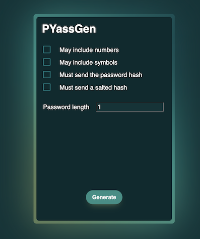

<!-- Improved compatibility of back to top link: See: https://github.com/othneildrew/Best-README-Template/pull/73 -->

<a name="readme-top"></a>

<!--
*** Thanks for checking out the Best-README-Template. If you have a suggestion
*** that would make this better, please fork the repo and create a pull request
*** or simply open an issue with the tag "enhancement".
*** Don't forget to give the project a star!
*** Thanks again! Now go create something AMAZING! :D
-->

<!-- PROJECT SHIELDS -->
<!--
*** I'm using markdown "reference style" links for readability.
*** Reference links are enclosed in brackets [ ] instead of parentheses ( ).
*** See the bottom of this document for the declaration of the reference variables
*** for contributors-url, forks-url, etc. This is an optional, concise syntax you may use.
*** https://www.markdownguide.org/basic-syntax/#reference-style-links
-->

[![Contributors][contributors-shield]][contributors-url]
[![Forks][forks-shield]][forks-url]
[![Stargazers][stars-shield]][stars-url]
[![Issues][issues-shield]][issues-url]
[![MIT License][license-shield]][license-url]

<!-- PROJECT LOGO -->
<br />
<div align="center">
  <a href="https://github.com/CGuilhem/PyassGen">
    
  </a>

<h3 align="center">PYassGen</h3>

  <p align="center">
    A simple password generator built with Flask and React
    <br />
    <a href="https://github.com/CGuilhem/PyassGen"><strong>Explore the docs »</strong></a>
    <br />
    <br />
    <a href="https://github.com/CGuilhem/PyassGen">View Demo</a>
    ·
    <a href="https://github.com/CGuilhem/PyassGen/issues">Report Bug</a>
    ·
    <a href="https://github.com/CGuilhem/PyassGen/issues">Request Feature</a>
  </p>
</div>

<!-- TABLE OF CONTENTS -->
<details>
  <summary>Table of Contents</summary>
  <ol>
    <li>
      <a href="#about-the-project">About The Project</a>
      <ul>
        <li><a href="#built-with">Built With</a></li>
      </ul>
    </li>
    <li>
      <a href="#getting-started">Getting Started</a>
      <ul>
        <li><a href="#prerequisites">Prerequisites</a></li>
        <li><a href="#installation">Installation</a></li>
      </ul>
    </li>
    <li><a href="#usage">Usage</a></li>
    <li><a href="#roadmap">Roadmap</a></li>
    <li><a href="#contributing">Contributing</a></li>
    <li><a href="#license">License</a></li>
    <li><a href="#contact">Contact</a></li>
    <li><a href="#acknowledgments">Acknowledgments</a></li>
  </ol>
</details>

<!-- ABOUT THE PROJECT -->

## About The Project 📔

<div align="center">
  
</div>

PYassGen is an automatic password generator builds with Flask and React.  
This will enable you to generate passwords using several parameters (size, presence of different types of characters), as well as their hash (salted or not).

<p align="right">(<a href="#readme-top">back to top</a>)</p>

### Built With 🏗️

[![React][React.js]][React-url] [![Flask][Flask]][Flask-url]

<p align="right">(<a href="#readme-top">back to top</a>)</p>

<!-- GETTING STARTED -->

## Getting Started 🎉

### Prerequisites

- Python  
   [Follow this link to install Python](https://www.python.org/downloads/)
- pnpm  
   [Follow this link to install pnpm](https://pnpm.io/installation)

### Installation

1. **Clone the repo**
   ```sh
   git clone https://github.com/CGuilhem/PyassGen.git
   ```
2. **Install front-end packages**
   ```sh
   cd PyassGen
   cd front
   pnpm i
   ```
3. **Run front-end application**
   ```sh
   pnpm run dev
   ```
4. **Create a virtual environment and launch it**

   - **macOS/Linux**

     ```sh
     cd PyassGen
     cd api
     python3 -m venv .venv
     . .venv/bin/activate
     ```

   - **Windows**

     ```sh
     cd PyassGen
     cd api
     py -3 -m venv .venv
     .venv\Scripts\activate
     ```

5. **Install back-end packages**

   ```sh
     pip install -r requirements.txt
   ```

6. **Run back-end application**
   ```sh
    flask --app src/api run
   ```

<p align="right">(<a href="#readme-top">back to top</a>)</p>

<!-- USAGE EXAMPLES -->

## Usage 💻

🚧 You can already generate passwords, but several other features are currently under development.

_For more examples, please refer to the [Documentation](https://example.com)_

<p align="right">(<a href="#readme-top">back to top</a>)</p>

<!-- ROADMAP -->

## Roadmap 🗺️

See the [open issues](https://github.com/CGuilhem/PyassGen/issues) for a full list of proposed features (and known issues).

<p align="right">(<a href="#readme-top">back to top</a>)</p>

<!-- CONTRIBUTING -->

## Contributing 🫂

Contributions are what make the open source community such an amazing place to learn, inspire, and create. Any contributions you make are **greatly appreciated**.

If you have a suggestion that would make this better, please fork the repo and create a pull request. You can also simply open an issue with the tag "enhancement".
Don't forget to give the project a star! Thanks again!

1. Fork the Project
2. Create your Feature Branch (`git checkout -b feature/AmazingFeature`)
3. Commit your Changes (`git commit -m 'Add some AmazingFeature'`)
4. Push to the Branch (`git push origin feature/AmazingFeature`)
5. Open a Pull Request

<p align="right">(<a href="#readme-top">back to top</a>)</p>

<!-- LICENSE -->

## License 🗒️

Distributed under the MIT License. See `LICENSE.txt` for more information.

<p align="right">(<a href="#readme-top">back to top</a>)</p>

<!-- CONTACT -->

## Contact 📇

Project Link: [https://github.com/CGuilhem/PyassGen](https://github.com/CGuilhem/PyassGen)

<p align="right">(<a href="#readme-top">back to top</a>)</p>

<!-- ACKNOWLEDGMENTS -->

## Acknowledgments 🙏

- [Thomas DUARTE](https://github.com/Thomas1301)

<p align="right">(<a href="#readme-top">back to top</a>)</p>

<!-- MARKDOWN LINKS & IMAGES -->
<!-- https://www.markdownguide.org/basic-syntax/#reference-style-links -->

[contributors-shield]: https://img.shields.io/github/contributors/CGuilhem/PyassGen.svg?style=for-the-badge
[contributors-url]: https://github.com/CGuilhem/PyassGen/graphs/contributors
[forks-shield]: https://img.shields.io/github/forks/CGuilhem/PyassGen.svg?style=for-the-badge
[forks-url]: https://github.com/CGuilhem/PyassGen/network/members
[stars-shield]: https://img.shields.io/github/stars/CGuilhem/PyassGen.svg?style=for-the-badge
[stars-url]: https://github.com/CGuilhem/PyassGen/stargazers
[issues-shield]: https://img.shields.io/github/issues/CGuilhem/PyassGen.svg?style=for-the-badge
[issues-url]: https://github.com/CGuilhem/PyassGen/issues
[license-shield]: https://img.shields.io/github/license/CGuilhem/PyassGen.svg?style=for-the-badge
[license-url]: https://github.com/CGuilhem/PyassGen/blob/master/LICENSE.txt
[linkedin-shield]: https://img.shields.io/badge/-LinkedIn-black.svg?style=for-the-badge&logo=linkedin&colorB=555
[product-screenshot]: images/PYassGen.png
[React.js]: https://img.shields.io/badge/React-20232A?style=for-the-badge&logo=react&logoColor=61DAFB
[React-url]: https://reactjs.org/
[Flask]: https://img.shields.io/badge/Flask-000000?style=for-the-badge&logo=flask&logoColor=white
[Flask-url]: https://flask.palletsprojects.com/en/2.3.x/
